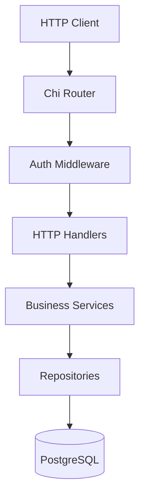
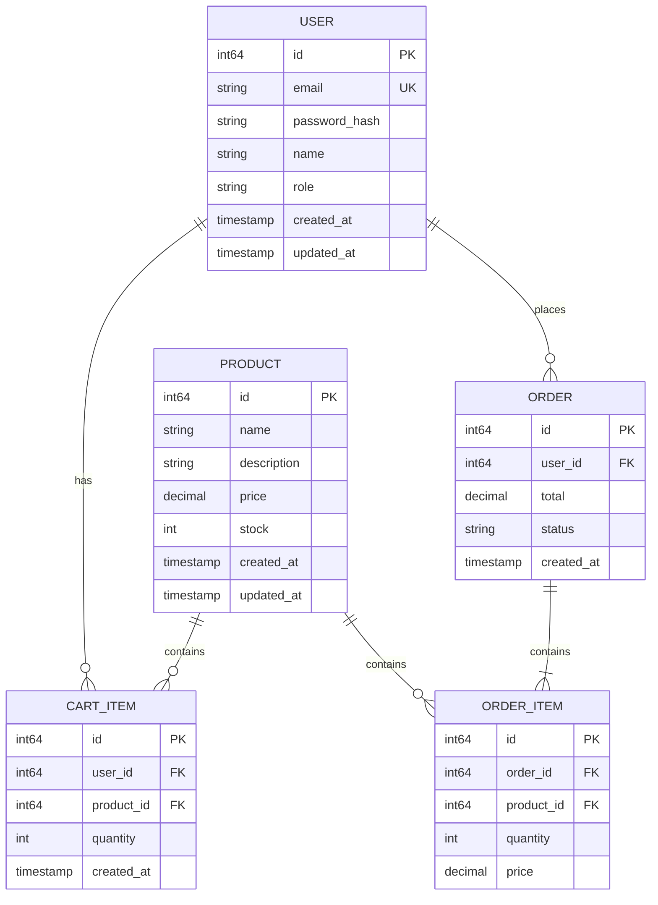

# Design Document: Go Ecommerce Demo

## Overview

This document describes the architecture and design for a demo ecommerce application built with Go and PostgreSQL. The system provides RESTful APIs for user authentication, product catalog management, shopping cart operations, and order processing. The application follows clean architecture principles with clear separation between HTTP handlers, business logic, and data access layers.

## Architecture

### High-Level Architecture



### Layer Responsibilities

1. **HTTP Layer**: Request routing, validation, response formatting
2. **Service Layer**: Business logic, orchestration, transaction management
3. **Repository Layer**: Data access, SQL queries, entity mapping
4. **Database Layer**: PostgreSQL for persistent storage

### Technology Stack

- **Language**: Go 1.21+
- **Router**: chi (lightweight, idiomatic HTTP router)
- **Database**: PostgreSQL 15+
- **Database Driver**: pgx (PostgreSQL driver for Go)
- **Authentication**: JWT (golang-jwt/jwt)
- **Password Hashing**: bcrypt
- **Configuration**: Environment variables
- **Testing**: testing-quick (Go's built-in property-based testing)

## Components and Interfaces

### Project Structure

```
/
├── cmd/
│   └── server/
│       └── main.go           # Application entry point
├── internal/
│   ├── config/
│   │   └── config.go         # Configuration management
│   ├── models/
│   │   ├── user.go           # User entity
│   │   ├── product.go        # Product entity
│   │   ├── cart.go           # Cart and CartItem entities
│   │   └── order.go          # Order and OrderItem entities
│   ├── repository/
│   │   ├── user_repo.go      # User data access
│   │   ├── product_repo.go   # Product data access
│   │   ├── cart_repo.go      # Cart data access
│   │   └── order_repo.go     # Order data access
│   ├── service/
│   │   ├── auth_service.go   # Authentication logic
│   │   ├── product_service.go# Product business logic
│   │   ├── cart_service.go   # Cart business logic
│   │   └── order_service.go  # Order business logic
│   ├── handler/
│   │   ├── auth_handler.go   # Auth HTTP handlers
│   │   ├── product_handler.go# Product HTTP handlers
│   │   ├── cart_handler.go   # Cart HTTP handlers
│   │   └── order_handler.go  # Order HTTP handlers
│   ├── middleware/
│   │   └── auth.go           # JWT authentication middleware
│   └── database/
│       └── postgres.go       # Database connection
├── migrations/
│   └── 001_initial.sql       # Database schema
├── go.mod
└── go.sum
```

### Key Interfaces

```go
// UserRepository defines user data access operations
type UserRepository interface {
    Create(ctx context.Context, user *User) error
    GetByID(ctx context.Context, id int64) (*User, error)
    GetByEmail(ctx context.Context, email string) (*User, error)
}

// ProductRepository defines product data access operations
type ProductRepository interface {
    Create(ctx context.Context, product *Product) error
    GetByID(ctx context.Context, id int64) (*Product, error)
    List(ctx context.Context, page, pageSize int) ([]Product, int, error)
    Search(ctx context.Context, keyword string, page, pageSize int) ([]Product, int, error)
    Update(ctx context.Context, product *Product) error
    Delete(ctx context.Context, id int64) error
    UpdateStock(ctx context.Context, id int64, quantity int) error
}

// CartRepository defines cart data access operations
type CartRepository interface {
    GetByUserID(ctx context.Context, userID int64) (*Cart, error)
    AddItem(ctx context.Context, userID, productID int64, quantity int) error
    UpdateItemQuantity(ctx context.Context, userID, productID int64, quantity int) error
    RemoveItem(ctx context.Context, userID, productID int64) error
    Clear(ctx context.Context, userID int64) error
}

// OrderRepository defines order data access operations
type OrderRepository interface {
    Create(ctx context.Context, order *Order) error
    GetByID(ctx context.Context, id int64) (*Order, error)
    ListByUserID(ctx context.Context, userID int64, page, pageSize int) ([]Order, int, error)
}
```

## Data Models

### Entity Relationship Diagram



### Go Structs

```go
type User struct {
    ID           int64     `json:"id"`
    Email        string    `json:"email"`
    PasswordHash string    `json:"-"`
    Name         string    `json:"name"`
    Role         string    `json:"role"` // "user" or "admin"
    CreatedAt    time.Time `json:"created_at"`
    UpdatedAt    time.Time `json:"updated_at"`
}

type Product struct {
    ID          int64     `json:"id"`
    Name        string    `json:"name"`
    Description string    `json:"description"`
    Price       float64   `json:"price"`
    Stock       int       `json:"stock"`
    CreatedAt   time.Time `json:"created_at"`
    UpdatedAt   time.Time `json:"updated_at"`
}

type CartItem struct {
    ID        int64    `json:"id"`
    UserID    int64    `json:"user_id"`
    ProductID int64    `json:"product_id"`
    Product   *Product `json:"product,omitempty"`
    Quantity  int      `json:"quantity"`
}

type Cart struct {
    UserID int64      `json:"user_id"`
    Items  []CartItem `json:"items"`
    Total  float64    `json:"total"`
}

type OrderItem struct {
    ID        int64   `json:"id"`
    OrderID   int64   `json:"order_id"`
    ProductID int64   `json:"product_id"`
    Quantity  int     `json:"quantity"`
    Price     float64 `json:"price"`
}

type Order struct {
    ID        int64       `json:"id"`
    UserID    int64       `json:"user_id"`
    Items     []OrderItem `json:"items"`
    Total     float64     `json:"total"`
    Status    string      `json:"status"` // "pending", "completed", "cancelled"
    CreatedAt time.Time   `json:"created_at"`
}
```

## Correctness Properties

*A property is a characteristic or behavior that should hold true across all valid executions of a system-essentially, a formal statement about what the system should do. Properties serve as the bridge between human-readable specifications and machine-verifiable correctness guarantees.*

### Property 1: User registration creates retrievable user
*For any* valid registration data (email, password, name), after registration the user should be retrievable by email with matching name and email fields.
**Validates: Requirements 1.1**

### Property 2: Invalid registration data is rejected
*For any* registration data with invalid email format, empty password, or empty name, the registration request should be rejected with validation errors.
**Validates: Requirements 1.2**

### Property 3: Valid credentials produce valid JWT
*For any* registered user, logging in with correct credentials should return a JWT that can be successfully validated and contains the correct user ID.
**Validates: Requirements 1.3**

### Property 4: Invalid credentials are rejected
*For any* login attempt with non-existent email or incorrect password, the request should be rejected with an authentication error.
**Validates: Requirements 1.4**

### Property 5: Product list contains required fields
*For any* product catalog state, listing products should return items where each product contains non-empty name, description, price >= 0, and stock >= 0.
**Validates: Requirements 2.1**

### Property 6: Search results match search term
*For any* search keyword and product catalog, all returned products should contain the keyword in either name or description (case-insensitive).
**Validates: Requirements 2.2**

### Property 7: Product CRUD round-trip
*For any* valid product data, creating a product and then retrieving it by ID should return a product with equivalent name, description, price, and stock values.
**Validates: Requirements 3.1, 3.2**

### Property 8: Non-admin users cannot manage products
*For any* non-admin user attempting create, update, or delete product operations, the request should be rejected with an authorization error.
**Validates: Requirements 3.4**

### Property 9: Adding to cart increases cart size
*For any* user and valid product with sufficient stock, adding the product to cart should increase the cart item count by one (if new product) or update quantity (if existing).
**Validates: Requirements 4.1**

### Property 10: Cart total equals sum of item prices
*For any* cart state, the cart total should equal the sum of (item.quantity * item.product.price) for all items in the cart.
**Validates: Requirements 4.4**

### Property 11: Insufficient stock prevents cart addition
*For any* product where requested quantity exceeds available stock, adding to cart should be rejected with a stock availability error.
**Validates: Requirements 4.5**

### Property 12: Order creation reduces stock and clears cart
*For any* non-empty cart where all items have sufficient stock, creating an order should: (1) create an order with matching items, (2) reduce each product's stock by ordered quantity, (3) clear the user's cart.
**Validates: Requirements 5.1**

### Property 13: Order history returns user's orders only
*For any* user requesting order history, all returned orders should belong to that user (order.user_id matches requesting user's ID).
**Validates: Requirements 5.3**

### Property 14: Data persistence round-trip
*For any* entity (User, Product, Order), storing to PostgreSQL and retrieving should return an equivalent entity with matching field values.
**Validates: Requirements 6.1, 6.2**

### Property 15: Transaction rollback on failure
*For any* multi-step operation (like order creation) where one step fails, all previous steps should be rolled back and database state should remain unchanged.
**Validates: Requirements 6.4**

### Property 16: API responses are valid JSON
*For any* API request (success or failure), the response body should be valid JSON parseable into the expected response structure.
**Validates: Requirements 7.1, 7.2, 7.3**

## Error Handling

### Error Types

```go
type AppError struct {
    Code    string            `json:"code"`
    Message string            `json:"message"`
    Fields  map[string]string `json:"fields,omitempty"`
}

// Error codes
const (
    ErrCodeValidation     = "VALIDATION_ERROR"
    ErrCodeAuthentication = "AUTHENTICATION_ERROR"
    ErrCodeAuthorization  = "AUTHORIZATION_ERROR"
    ErrCodeNotFound       = "NOT_FOUND"
    ErrCodeConflict       = "CONFLICT"
    ErrCodeInternalError  = "INTERNAL_ERROR"
    ErrCodeInsufficientStock = "INSUFFICIENT_STOCK"
)
```

### HTTP Status Mapping

| Error Code | HTTP Status |
|------------|-------------|
| VALIDATION_ERROR | 400 Bad Request |
| AUTHENTICATION_ERROR | 401 Unauthorized |
| AUTHORIZATION_ERROR | 403 Forbidden |
| NOT_FOUND | 404 Not Found |
| CONFLICT | 409 Conflict |
| INSUFFICIENT_STOCK | 422 Unprocessable Entity |
| INTERNAL_ERROR | 500 Internal Server Error |

### Error Response Format

```json
{
    "code": "VALIDATION_ERROR",
    "message": "Invalid input data",
    "fields": {
        "email": "Invalid email format",
        "password": "Password must be at least 8 characters"
    }
}
```

## Testing Strategy

### Dual Testing Approach

This project uses both unit tests and property-based tests for comprehensive coverage:

1. **Unit Tests**: Verify specific examples, edge cases, and integration points
2. **Property-Based Tests**: Verify universal properties that should hold across all valid inputs

### Property-Based Testing Framework

- **Framework**: Go's built-in `testing/quick` package
- **Minimum iterations**: 100 per property test
- **Annotation format**: `// **Feature: go-ecommerce-demo, Property {number}: {property_text}**`

### Test Organization

```
/
├── internal/
│   ├── models/
│   │   └── models_test.go        # Model validation tests
│   ├── repository/
│   │   └── *_repo_test.go        # Repository integration tests
│   ├── service/
│   │   └── *_service_test.go     # Service unit + property tests
│   └── handler/
│       └── *_handler_test.go     # Handler tests
```

### Unit Test Coverage

- Model validation functions
- Service business logic with mocked repositories
- Handler request/response formatting
- Error handling paths

### Property Test Coverage

Each correctness property from the design document will have a corresponding property-based test:

- Property 1-4: Authentication service tests
- Property 5-6: Product listing and search tests
- Property 7-8: Product CRUD and authorization tests
- Property 9-11: Cart operation tests
- Property 12-13: Order creation and history tests
- Property 14-15: Data persistence tests
- Property 16: API response format tests

### Test Database

- Use Docker container for PostgreSQL test instance
- Each test suite creates isolated test data
- Transactions rolled back after each test for isolation
